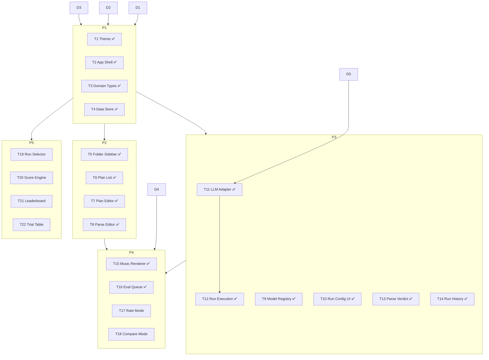

# MusicBench — Roadmap

## Current State

The app is a blank Vite/React/Tailwind template with a single `Button` shadcn component and no routing, data layer, or application logic. The CSS theme uses shadcn defaults (neutral palette, light-mode primary) rather than the design spec.

---

## Decisions Required

These are architectural choices that must be settled before the phases that depend on them. They are listed in priority order.

### D1 — Data Persistence ✅ Dexie (IndexedDB)

All domain objects (Plans, Runs, Trials, Judgments) need to be stored somewhere.

| Option                   | Pros                                                | Cons                                                     |
| ------------------------ | --------------------------------------------------- | -------------------------------------------------------- |
| `localStorage`           | Zero setup, synchronous, works offline              | ~5MB cap, no queries, blocks main thread on large writes |
| `IndexedDB` via Dexie.js | Large capacity, async, supports indexes and queries | More setup, async everywhere                             |
| Backend API              | Unlimited, shareable, multi-user ready              | Requires building infra, adds auth concerns              |

**Recommendation:** Start with Dexie (IndexedDB). Storage needs are small today but Trials accumulate quickly. Dexie's API is clean and the async cost is low in React. A backend can be added later with the same interface.

### D2 — State Management ✅ Zustand

Client state (selected plan, active run, UI state) needs a home separate from persistence.

| Option                     | Notes                                                            |
| -------------------------- | ---------------------------------------------------------------- |
| Zustand                    | Lightweight, minimal boilerplate, good for cross-component state |
| React Context + useReducer | No extra dep, fine for simpler trees                             |
| Jotai                      | Atom-based, good for derived/computed state                      |

**Recommendation:** Zustand. The domain has several independent slices (plans, runs, evaluation queue) and Zustand's slice pattern maps cleanly to them.

### D3 — Router ✅ TanStack Router

Four surfaces (Build, Run, Evaluate, Explore) plus deep-link URLs for individual plans, runs, and trials.

| Option          | Notes                                          |
| --------------- | ---------------------------------------------- |
| TanStack Router | Type-safe routes, file-based optional, good DX |
| React Router v7 | Mature, widely documented                      |
| Wouter          | Minimal, no file-based routing                 |

**Recommendation:** TanStack Router. Type-safe `Link` and `useParams` catches errors early and the project will have enough route nesting to benefit.

### D4 — Music Rendering Format ✅ Stub → abcjs

Start with `StubRenderer` (raw monospace text) to unblock the Evaluate surface. Add abcjs for ABC notation as a follow-on once the eval workflow is validated.

### D5 — LLM API Access Pattern ✅ OpenRouter (direct browser calls)

Direct browser calls to [OpenRouter](https://openrouter.ai) (`https://openrouter.ai/api/v1`), which provides an OpenAI-compatible API for many providers (Anthropic, OpenAI, etc.). API key stored in `localStorage` under `mb:openrouter-key`. Acceptable for a single-admin personal tool. A `MockAdapter` is built first to unblock UI development without a real key.

---

## Dependency Map



---

## Phase 1 — Foundation

No decisions block this phase (except D1–D3 which must be settled first).

### T1 — Theme ✅

Rework `src/index.css` CSS variables to match the design spec. The current shadcn defaults use a neutral gray palette with light-mode primary; the spec calls for dark-mode default with a cool blue accent.

- Replace `:root` light mode tokens: near-white background, warm paper tone, charcoal text, cool blue accent
- Replace `.dark` tokens: near-black background, slightly lifted surface for cards, off-white text, cool blue accent at full saturation
- Add semantic color tokens: `--success`, `--warning`, `--error`, `--info` (four hues, consistent across modes)
- Add model color tokens: 6–8 distinguishable hues (`--model-1` through `--model-8`) for provider badges and chart bars
- Set `dark` class on `<html>` as default; add a theme toggle that persists to localStorage
- Verify radius values (~8–10px per design spec; current default `0.625rem` is close but should be confirmed)

### T2 — App Shell & Routing ✅

Install and configure the chosen router (D3). Build the persistent outer chrome.

- Top navigation bar: app name/logo left, four surface tabs (Build / Run / Evaluate / Explore) center or right
- Active tab highlight using accent color
- Route definitions for each surface, plus nested routes for plan detail, run detail, trial detail
- 404 / redirect-to-default route
- Dark mode toggle wired to theme class (from T1)
- Each surface renders a placeholder page so navigation is testable end-to-end

### T3 — Domain Types ✅

Define TypeScript interfaces for all domain entities in `src/types/`. No runtime logic — types only.

```
Folder        { id, name, parentId?, createdAt }
Plan          { id, folderId, name, promptTemplate, inputs[], evalStrategy, parseCode? }
Model         { id, name, provider, apiBase? }
Run           { id, planId, modelIds[], status, startedAt, completedAt? }
Trial         { id, runId, modelId, input, output?, latencyMs?, tokens?, status }
Verdict       { trialId, type: 'verdict', pass: boolean, error? }
Rating        { trialId, type: 'rating', score: 1|2|3|4|5 }
Ranking       { runId, inputIndex, type: 'ranking', modelRanks: { modelId, rank }[] }
Judgment      Verdict | Rating | Ranking
Report        { runId, modelScores: { modelId, score, trialCount }[] }
```

Also define the adapter interfaces:
- `MusicRenderer` — `render(output: string, container: HTMLElement): void; destroy(): void`
- `LLMAdapter` — `call(model: Model, prompt: string, input: string): Promise<{ output: string; latencyMs: number; tokens: number }>`

### T4 — Data Store ✅

Implement the persistence layer (D1) and a Zustand store (D2) wired to it.

- Dexie schema for all domain tables: `folders`, `plans`, `runs`, `trials`, `judgments`
- Zustand store with slices:
  - `plansSlice` — CRUD for Folders and Plans, active selection
  - `runsSlice` — CRUD for Runs and Trials, active run state
  - `evaluationSlice` — evaluation queue, active judgment workflow
- Typed hooks: `usePlans()`, `useRuns()`, `useTrials(runId)`, etc.
- Seed function that writes fixture data on first load (e.g. two folders, three plans, one completed run with trials and judgments) so every surface has something to render immediately

---

## Phase 2 — Build Surface

Two-panel layout: folder/plan tree on the left, plan editor on the right.

### T5 — Folder Sidebar ✅

Narrow left panel (~220px) with the folder tree.

- Collapsible folder nodes; click to expand/collapse
- Plan count badge per folder
- Context menu (right-click or `⋯` icon): rename, delete folder, new subfolder
- "New Folder" button at the bottom
- Clicking a plan navigates to the plan editor route
- Active plan highlighted with accent background

### T6 — Plan List ✅

Plans appear inline under their folder in the sidebar (T5). This task covers the plan-level interactions.

- Inline plan items: name, eval strategy badge (Parse / Rate / Compare)
- Context menu: rename, duplicate, delete, move to folder
- "New Plan" button within folder context (pre-selects the parent folder)
- Newly created plan is immediately selected and the editor scrolls into view

### T7 — Plan Editor ✅

Right panel. Edits are auto-saved (debounced) to the store.

- Plan name (inline editable heading)
- Eval strategy selector: segmented control (Parse / Rate / Compare); changing strategy clears any existing parse code after confirmation
- Prompt template textarea with `{{input}}` highlighted (simple syntax highlighting — a span wrap is enough, no code editor library needed here)
- Input list: add, edit inline, delete, reorder (drag or up/down arrows); each input is a plain text string
- Unsaved indicator if debounce hasn't fired; explicit Save button as fallback

### T8 — Parse Code Editor ✅

Shown when eval strategy is `Parse`. Replaces (or appears below) the prompt template section.

- Code editor for the assertion function; install a lightweight editor (CodeMirror 6 or Monaco — decide at implementation time based on bundle size)
- Expected signature shown as a comment: `// function assert(output: string): boolean`
- "Test" button: runs the assertion against each input using the first item in the input list as a sample; shows pass/fail inline
- Syntax error display below the editor
- The execution environment is sandboxed (`new Function` or an iframe sandbox — document the choice)

---

## Phase 3 — Run Surface

Two-panel layout: config left, run history right (roughly equal widths per design spec).

### T9 — Model Registry ✅

Settings page or slide-over panel for configuring available models. This data feeds the model multi-select in T10.

- List of configured models: name, provider badge, enabled toggle
- Add model form: name, provider (Anthropic / OpenAI / Other), API base URL override
- Delete model
- Models persisted in a `models` Dexie table (or Zustand store with localStorage for simpler config)
- A handful of fixture models included in seed data (e.g. `claude-opus-4-6`, `gpt-4o`)

### T10 — Run Configuration UI ✅

Left panel of the Run surface.

- Plan selector: searchable dropdown or combobox showing folder/plan hierarchy
- Model multi-select: checkbox list of enabled models from T9; at least one must be selected
- "Launch Run" button (disabled if validation fails); disables while a run is in progress
- Validation: plan must have at least one input; at least one model selected

### T11 — LLM Adapter ✅

Pluggable adapter layer. Build a mock first; real adapters follow (D5).

- `MockAdapter`: returns canned output (`"T{{ index }}: sample output for {{input}}"`) with a configurable delay (default 500ms) and fake token count; useful for developing all other Run/Evaluate/Explore UI without API keys
- `AnthropicAdapter`: direct fetch to Anthropic Messages API; reads key from localStorage config
- Adapter registry: maps provider name to adapter class; selected by `Model.provider`
- API key configuration UI (simple settings form; key stored in localStorage under a namespaced key)

### T12 — Run Execution Engine ✅

Core async logic that drives a Run from `pending` to `complete`.

- `src/lib/runExecutor.ts` — `executeRun(runId, onProgress, isCancelled)`: fetches run/plan/models, creates trials (model × input order), executes sequentially, writes verdicts for parse plans
- `src/hooks/useRunExecutor.ts` — `useRunExecutor()`: watches `activeRunId` in Zustand, fires executor, clears active run on completion
- Mounted in `RunPage`; cancellation checked between trials via `useUIStore.getState().cancelRequested`
- Failed trials marked `status: 'failed'`; execution continues for remaining trials

### T13 — Parse Verdict Engine ✅

Called inline by T12 for Parse-strategy plans.

- `src/lib/parseVerdict.ts` — `runParseAssertion(trialId, parseCode, output)`: runs assertion via `new Function()`, returns `Verdict` with `pass`/`error`; thrown errors captured as `pass: false`

### T14 — Run History List ✅

Right panel of the Run surface.

- `src/components/run/RunHistoryPanel.tsx` — live-queried list (runs, plans, trials) sorted newest-first
- Per-run row: plan name, status badge, model count, trial count, elapsed time, relative timestamp
- Running run shows a progress bar and trial counter updated live from the Zustand store
- Click any run navigates to `/explore/$runId`

---

## Phase 4 — Evaluate Surface

Two-panel layout: queue left, evaluation workspace right.

### T15 — Music Renderer Component ✅

Pluggable `<MusicRenderer output={string} />` component.

- `src/components/music/MusicRenderer.tsx` — self-contained dark region (forces `.dark` CSS variables via class)
- `src/lib/renderers/stub.ts` — `StubRenderer`: raw monospace output with "No renderer configured" notice
- `src/lib/renderers/index.ts` — registry + `getActiveRenderer()`; inline doc for adding new renderers (e.g. abcjs)
- `src/hooks/useRenderer.ts` — `useRenderer(output)` returns `{ containerRef, error }`

### T16 — Evaluation Queue ✅

Left panel of the Evaluate surface.

- `src/components/evaluate/EvalQueuePanel.tsx` — live query loads complete Rate/Compare runs, computes remaining count (unrated trials / unranked inputs) per run
- Completed runs greyed out (`opacity-50`); active row highlighted with accent
- Active run detected from current URL pathname via `useRouterState`
- Click navigates to `/evaluate/$runId`

### T17 — Rate Mode

Right panel when a `Rate`-strategy run is selected.

- Step-through interface: one Trial at a time
- Header: model badge, input text, progress indicator (e.g. "Trial 3 of 12")
- Music renderer (T15) displaying the trial output
- Raw output collapsible section (monospace, scrollable)
- Star rating widget: 5 stars, click to set; current rating shown if already rated
- "Next" / "Previous" navigation; "Skip" for undecided trials
- Ratings auto-saved on selection; "Done" button when all trials rated

### T18 — Compare Mode

Right panel when a `Compare`-strategy run is selected.

- One Input at a time; sidebar shows input list with completion status
- Side-by-side columns, one per Model (scroll horizontally if > 3 models)
- Each column: model badge, music renderer, raw output collapsible
- Ranking widget: drag-to-reorder or up/down arrow-controlled vertical stack; displays current rank for each model
- Rankings auto-saved on change; "Next Input" button
- Summary view: shows how many inputs have been fully ranked

---

## Phase 5 — Explore Surface

Two-panel layout: run selector left, report right.

### T19 — Run Selector

Narrow left panel listing completed runs.

- Filter to runs with status `complete` and at least one judgment
- Per-run row: plan name, model count, eval strategy badge, date
- Click to load the report for that run into the right panel

### T20 — Score Computation

Pure function (no UI): `computeReport(run, trials, judgments) → Report`.

- **Parse** — pass rate per model: `passCount / totalTrials`
- **Rate** — mean rating per model, normalized to 0–1: `mean(ratings) / 5`
- **Compare** — inverse mean rank per model, normalized to 0–1: `1 - (mean(ranks) - 1) / (modelCount - 1)`
- `Report` includes: `runId`, `evalStrategy`, `modelScores[]` (modelId, score, trialCount, rawStats)
- Cover edge cases: no judgments returns `null` scores; single model in Compare returns score of 1

### T21 — Leaderboard

Upper half of right panel.

- Horizontal bar chart: one bar per model, width = normalized score, labeled with model name and score
- Bars use model colors (from T1 token set) keyed by provider
- Sorted by score descending
- Score transitions on mount (~500ms ease per design spec)
- Shows trial count and eval strategy as metadata below the chart

### T22 — Trial Detail Table

Lower half of right panel (or full panel with leaderboard collapsed).

- One row per Trial: model (badge), input (truncated), judgment (verdict icon / rating stars / rank), latency, tokens
- Sticky header; alternating row tint
- Sortable columns: model, judgment, latency, tokens
- Filter bar: model multi-select, min/max score range, input text search
- Click a row to expand: full output in a monospace block, full input, renderer preview

---

## Deferred (Post-MVP)

From `docs/goal.md` future considerations — not planned here but worth keeping in mind when making architectural choices:

- **Prompt versioning** — track plan history; avoid destructive edits to Plans that have associated Runs
- **Model config variants** — temperature, system prompt as first-class identifiers
- **Parallel trial execution** — batch API calls with rate limiting
- **Export** — CSV/JSON download of Reports
- **Cross-Run comparison** — same Plan across multiple Runs/dates
- **Multi-admin evaluation** — inter-rater agreement metrics
- **Notation-specific parse helpers** — ABC syntax validation, MusicXML schema check
